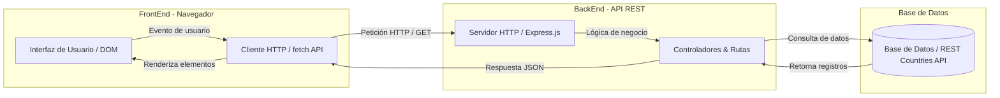

# Countries Explorer — Diseño de API REST

Countries Explorer es una aplicación web para explorar información de países del
mundo (listado, búsqueda, filtrado y detalle). Este documento detalla el diseño
de la **API REST** que necesitará la aplicación, tomando como referencia la
API [REST Countries](https://restcountries.com).

---

## 1. Arquitectura del Sistema

### 1.1 Diagrama Cliente-Servidor


### 1.2 Flujo de Datos de una Petición

**Ejemplo de recorrido:** El usuario busca un país por su nombre (ejemplo: *"Bolivia"*).

1. El usuario escribe *"Bolivia"* en el campo de búsqueda de la interfaz web y presiona el botón "Buscar" (o genera un evento `input`/`submit`).

2. `fetch` (Cliente HTTP), el código JavaScript en el navegador captura el evento y ejecuta una petición asíncrona:

    ```javascript
    fetch('/api/v1/paises?q=Bolivia')
    ```

3. El servidor recibe la petición HTTP `GET`, analiza el parámetro de consulta `q=Bolivia`, valida los datos y consulta la base de datos o el servicio origen.

4. El servidor retorna la información estructurada con un código de estado `200 OK` en formato JSON:

    ```json
    {
      "total": 1,
      "paises": [
        {
            "code": "BOL",
            "name": "Bolivia",
            "official_name": "Estado Plurinacional de Bolivia",
            "population": 11673021,
            "region": "América",
            "subregion": "América del Sur",
            "capital": "Sucre",
            "currency_code": "BOB",
            "currency_name": "Boliviano",
            "languages": ["Español", "Quechua", "Aymara"],
            "borders": ["ARG", "BRA", "CHL", "PRY", "PER"],
            "landlocked": true,
            "area": 1098581,
            "coordinates": { "latitude": -16.29, "longitude": -63.59 },
            "timezones": ["America/La_Paz"],
            "calling_code": "+591",
            "demonym": "Boliviano",
            "flag_url": "https://flagcdn.com/w320/bo.png",
            "flag_emoji": "🇧🇴"
        }
      ]
    }
    ```

5. El navegador procesa la promesa recibida en el `fetch()`, transforma el JSON a objetos JavaScript y manipula el DOM (`document.querySelector` / `innerHTML`) para pintar la tarjeta del país en la interfaz.


---

## 1. Recurso central: `paises`

La entidad central del proyecto es el **país**. Es un recurso con identidad única,
atributos bien definidos y relaciones con otros recursos de su mismo tipo (las
fronteras), por lo que se presta naturalmente al modelo REST.

Como identificador, usar el **código ISO 3166-1 alpha-3** (`BOL`, `ARG`, `DEU`)
en lugar de un id numérico, por estas razones:

- Es un estándar internacional: estable, documentado y reconocido.
- Tiene significado por sí mismo, lo que hace legibles las URLs
  (`/api/v1/paises/BOL` en vez de `/api/v1/paises/7`).

### Campos del recurso

Los nombres de campo van en inglés —la convención técnica universal para
esquemas JSON— mientras que el **contenido** se entrega en español, que es el
idioma de los usuarios de la aplicación. La única excepción es `official_name`,
que se mantiene en el idioma oficial de cada país: un nombre oficial es, por
definición, un término nativo.

| Campo           | Tipo           | Descripción                                                | Ejemplo                                        |
| --------------- | -------------- | ---------------------------------------------------------- | ---------------------------------------------- |
| `code`          | string (3)     | Código ISO 3166-1 alpha-3. Identificador del recurso       | `"BOL"`                                        |
| `name`          | string         | Nombre de uso común                                        | `"Bolivia"`                                    |
| `official_name` | string         | Denominación oficial, en el idioma del país                | `"Estado Plurinacional de Bolivia"`            |
| `population`    | number         | Cantidad de habitantes                                     | `11673021`                                     |
| `region`        | string         | Región geográfica                                          | `"América"`                                    |
| `subregion`     | string         | Subregión según el geoesquema de la ONU                    | `"América del Sur"`                            |
| `capital`       | string         | Ciudad capital                                             | `"Sucre"`                                      |
| `currency_code` | string (3)     | Código de la moneda, estándar ISO 4217                     | `"BOB"`                                        |
| `currency_name` | string         | Nombre de la moneda                                        | `"Boliviano"`                                  |
| `languages`     | string[]       | Idiomas oficiales                                          | `["Español", "Quechua", "Aymara"]`             |
| `borders`       | string[]       | Países limítrofes (códigos alpha-3)                        | `["ARG", "BRA", "CHL", "PRY", "PER"]`          |
| `landlocked`    | boolean        | Sin salida al mar (pareja conceptual de `borders`)         | `true`                                         |
| `area`          | number         | Superficie en km²                                          | `1098581`                                      |
| `coordinates`   | object         | Centro geográfico: `{ latitude, longitude }`               | `{"latitude": -16.29, "longitude": -63.59}`    |
| `timezones`     | string[]       | Husos horarios, formato IANA                               | `["America/La_Paz"]`                           |
| `calling_code`  | string         | Prefijo telefónico, con el `+` incluido                    | `"+591"`                                       |
| `demonym`       | string         | Gentilicio                                                 | `"Boliviano"`                                  |
| `flag_url`      | string (URL)   | Imagen de la bandera                                       | `"https://flagcdn.com/w320/bo.png"`            |
| `flag_emoji`    | string         | Bandera en emoji, para interfaces livianas                | `"🇧🇴"`                                         |

---

## 2. Endpoints CRUD

Ruta base del recurso: **`/api/v1/paises`**

| Método   | Ruta                      | Descripción                                   | Respuesta exitosa |
| -------- | ------------------------- | --------------------------------------------- | ----------------- |
| `GET`    | `/api/v1/paises`          | Lista de países (filtros, orden, paginación)  | `200 OK`          |
| `GET`    | `/api/v1/paises/{codigo}` | Un país por su código alpha-3                 | `200 OK`          |
| `POST`   | `/api/v1/paises`          | Crea un país nuevo                            | `201 Created`     |
| `PUT`    | `/api/v1/paises/{codigo}` | Reemplaza por completo un país existente      | `200 OK`          |
| `PATCH`  | `/api/v1/paises/{codigo}` | Actualiza solo los campos enviados            | `200 OK`          |
| `DELETE` | `/api/v1/paises/{codigo}` | Elimina un país                               | `204 No Content`  |

`PUT` y `PATCH` se complementan: `PUT` exige el recurso completo en el body
(los campos omitidos se pierden), mientras que `PATCH` modifica únicamente lo
que envía el cliente. Un editor de ficha completa usa `PUT`; uno que solo
actualiza la población de un país usa `PATCH` sin riesgo de borrar el resto.

### 2.1 La lista: filtros, orden, proyección y paginación

Un buen endpoint de lista no devuelve "todo de una vez": se diseña desde el
inicio con parámetros de consulta, porque cualquier cliente (web, móvil, otro
servicio) puede necesitarlos:

| Parámetro | Ejemplo                     | Descripción                                                        |
| --------- | --------------------------- | ------------------------------------------------------------------ |
| `region`  | `?region=América`           | Filtra por región exacta                                           |
| `q`       | `?q=bol`                    | Búsqueda por nombre, coincidencia parcial e insensible a mayúsculas |
| `sort`    | `?sort=population-desc`     | Ordena por `name` o `population`, ascendente o descendente         |
| `fields`  | `?fields=code,name,population` | Devuelve solo los campos indicados (proyección de la respuesta) |
| `limit`   | `?limit=20`                 | Países por página (por defecto 20)                                 |
| `offset`  | `?offset=40`                | Cuántos saltar (para avanzar de página)                            |

Los parámetros se pueden combinar entre sí:
`GET /api/v1/paises?region=Europa&sort=population-desc&limit=10&offset=0`

### 2.2 Endpoints auxiliares

| Método | Ruta                             | Descripción                                                       |
| ------ | -------------------------------- | ----------------------------------------------------------------- |
| `GET`  | `/api/v1/regions`                | Catálogo de regiones y subregiones                                 |
| `GET`  | `/api/v1/paises/{codigo}/borders`| Los países vecinos de un país, como recursos completos            |

- **`/api/v1/regions`**: cualquier cliente necesita llenar un filtro por
  región, y pedirlo "adivinando" al endpoint de lista sería frágil. Un catálogo
  auxiliar entrega los valores válidos de una sola vez.
- **`/api/v1/paises/{codigo}/borders`**: el campo `borders` devuelve códigos;
  para mostrar los vecinos con nombre y bandera, un cliente tendría que hacer
  una petición extra por cada código (el clásico problema *N+1*). El
  sub-recurso los entrega ya resueltos en una sola petición.

### 2.3 Códigos de estado

| Código | Cuándo se devuelve                                        |
| ------ | --------------------------------------------------------- |
| `200`  | Petición exitosa (GET, PUT y PATCH)                       |
| `201`  | País creado (POST)                                        |
| `204`  | Eliminación exitosa (DELETE) — sin cuerpo en la respuesta |
| `400`  | Body inválido (campos faltantes o con tipos incorrectos)  |
| `404`  | No existe un país con el código indicado                  |
| `500`  | Error inesperado del servidor                             |

---

## 3. JSON de ejemplo

### GET `/api/v1/paises/BOL` → `200 OK`

```json
{
    "code": "BOL",
    "name": "Bolivia",
    "official_name": "Estado Plurinacional de Bolivia",
    "population": 11673021,
    "region": "América",
    "subregion": "América del Sur",
    "capital": "Sucre",
    "currency_code": "BOB",
    "currency_name": "Boliviano",
    "languages": ["Español", "Quechua", "Aymara"],
    "borders": ["ARG", "BRA", "CHL", "PRY", "PER"],
    "landlocked": true,
    "area": 1098581,
    "coordinates": { "latitude": -16.29, "longitude": -63.59 },
    "timezones": ["America/La_Paz"],
    "calling_code": "+591",
    "demonym": "Boliviano",
    "flag_url": "https://flagcdn.com/w320/bo.png",
    "flag_emoji": "🇧🇴"
}
```

### GET `/api/v1/paises?region=América&fields=code,name,population,flag_url&limit=2` → `200 OK`

```json
{
    "total": 5,
    "paises": [
        {
            "code": "ARG",
            "name": "Argentina",
            "population": 45376763,
            "flag_url": "https://flagcdn.com/w320/ar.png"
        },
        {
            "code": "BOL",
            "name": "Bolivia",
            "population": 11673021,
            "flag_url": "https://flagcdn.com/w320/bo.png"
        }
    ]
}
```

(`total` informa cuántos países cumplen el filtro en total, sin importar el
`limit`: así el cliente puede armar su paginación. Con `fields`, los campos no
incluidos simplemente no viajan en la respuesta.)

### POST `/api/v1/paises` — body de la petición

```json
{
    "code": "URY",
    "name": "Uruguay",
    "official_name": "República Oriental del Uruguay",
    "population": 3473730,
    "region": "América",
    "subregion": "América del Sur",
    "capital": "Montevideo",
    "currency_code": "UYU",
    "currency_name": "Peso uruguayo",
    "languages": ["Español"],
    "borders": ["ARG", "BRA"],
    "landlocked": false,
    "area": 176215,
    "coordinates": { "latitude": -32.52, "longitude": -55.77 },
    "timezones": ["America/Montevideo"],
    "calling_code": "+598",
    "demonym": "Uruguayo",
    "flag_url": "https://flagcdn.com/w320/uy.png",
    "flag_emoji": "🇺🇾"
}
```

Respuesta `201 Created`: el recurso creado (igual al body enviado) más el
header `Location: /api/v1/paises/URY`.
Si ya existiera un país con ese `code` → `400` con
`{ "error": "Ya existe un país con el código URY" }`.

### GET `/api/v1/paises/BOL/borders` → `200 OK`

```json
{
    "total": 5,
    "paises": [
        { "code": "ARG", "name": "Argentina", "flag_emoji": "🇦🇷" },
        { "code": "BRA", "name": "Brasil", "flag_emoji": "🇧🇷" }
    ]
}
```

(Respuesta abreviada para el ejemplo: el endpoint devuelve el objeto completo
de cada vecino, y aquí se usó el parámetro `fields` para mantenerla corta.)

### GET `/api/v1/paises/XXX` (no existe) → `404 Not Found`

```json
{
    "error": "No se encontró el país con código XXX"
}
```

---

## 4. Lenguaje elegido: Node.js con Express

El backend se implementaría en **JavaScript con Node.js y el framework
Express**, por las siguientes razones:

1. **Un solo lenguaje en todo el proyecto.** El frontend ya es JavaScript;
   usar el mismo lenguaje en el backend reduce la curva de aprendizaje y evita
   cambiar de contexto entre capas.
2. **JSON es nativo.** Una API REST vive de JSON, y en JavaScript leer,
   escribir y manipular objetos JSON es parte del lenguaje mismo, sin
   conversiones.
3. **Express es simple y está muy documentado.** Es minimalista: definir una
   ruta `GET /api/v1/paises/:codigo` toma unas líneas, y al ser uno de los
   frameworks más usados del mundo, el material de estudio y la comunidad son
   enormes.
4. **Ecosistema npm.** Validación de datos, conexión a bases de datos, tests:
   casi todo tiene un paquete maduro a un `npm install` de distancia.


---


## 1. Analiza una interfaz

### COUNTRIES EXPLORER

La interfaz de mi proyecto usa un diseño oscuro y bastante simple. La mayor parte de la pantalla se centra en las tarjetas de los países, donde se muestra la bandera, el nombre, la población, la región y la capital. Arriba están las opciones para buscar, filtrar por región y ordenar los resultados.

En cuanto a la **jerarquía visual**, se nota que el nombre del proyecto y los nombres de los países son lo que más destaca, siendo estos los elementos principales. Dentro de cada tarjeta, primero llama la atención el nombre del país y después aparecen datos como la población, la región y la capital como información secundaria.

Cuando se selecciona un país, se muestra un panel con más información. Esto ayuda a que el usuario pueda entender rápido qué es lo más importante y qué datos son secundarios.

Sobre el **contraste**, la página usa fondos oscuros con textos claros, por lo que en general la información se puede leer bien. También se usa un color celeste para resaltar algunos elementos importantes o interactivos. Esto sirve para que ciertas partes llamen más la atención sin llenar toda la página de colores.

En la **alineación y proximidad**, los elementos están bastante ordenados. La información de cada país se mantiene junta dentro de su tarjeta, y los controles como la búsqueda y los filtros están agrupados en una misma zona. Esto hace que la interfaz no se vea desordenada y sea más fácil entender qué cosas están relacionadas entre sí.

También hay bastante **repetición y consistencia**, ya que todas las tarjetas tienen prácticamente la misma estructura, colores, bordes y forma de mostrar la información. Eso ayuda porque el usuario no tiene que aprender cómo funciona cada tarjeta por separado, ya que todas siguen el mismo estilo.

Sobre el **espacio**, la interfaz deja una separación razonable entre tarjetas y controles, así que no se siente demasiado cargada. La distribución en forma de cuadrícula también ayuda bastante a mantener todo ordenado.

### UX: qué funciona

- La lista de países se reconoce rápidamente.
- El filtro por región reduce los resultados sin cambiar de página.
- La búsqueda permite localizar un país.
- Las tarjetas mantienen un patrón consistente.
- La interfaz es responsive.
- Al seleccionar una tarjeta se presenta información adicional sin abandonar la vista principal.

### UX: qué mejoraría

- La búsqueda puede simplificarse y hacerse más tolerante a coincidencias parciales.
- Cuando se conecte la API será necesario mostrar estados de cargando, error y sin resultados.
- Las tarjetas deberían mejorar su navegación mediante teclado.
- Sería conveniente indicar visualmente cuándo una tarjeta tiene `hover`, foco o está seleccionada.

---

## 2. Define tu paleta

Para el rediseño visual se propone una interfaz clara, a diferencia del diseño oscuro que tiene actualmente el proyecto.

La idea es usar fondos blancos y grises claros para que la información sea fácil de leer y para que las banderas de los países puedan destacar más.

| Rol | Color | Uso |
|---|---|---|
| Primario | `#2563EB` | Botones, enlaces y elementos principales |
| Secundario | `#0F766E` | Elementos de apoyo o filtros |
| Fondo principal | `#F8FAFC` | Fondo general |
| Superficie | `#FFFFFF` | Tarjetas y paneles |
| Texto principal | `#0F172A` | Títulos y contenido importante |
| Texto secundario | `#64748B` | Información secundaria |
| Bordes | `#E2E8F0` | Límites de tarjetas y controles |

La idea es no utilizar demasiados colores, sino que cada uno tenga una función definida dentro de la interfaz.

---

## 3. Elige la tipografía

Se utilizará una sola familia tipográfica como principal: **Inter**, ya que tiene buena legibilidad en pantallas y funciona bien tanto en textos grandes como pequeños.

### Escala tipográfica

| Elemento | Tamaño | Peso | Interlineado | Uso |
|---|---:|---|---:|---|
| H1 | 32 px | Bold | 40 px | Título principal de la aplicación |
| H2 | 24 px | SemiBold | 32 px | Títulos de secciones o paneles |
| H3 | 20 px | SemiBold | 28 px | Nombres de países o subtítulos |
| Texto normal | 16 px | Regular | 24 px | Información principal y contenido |
| Texto secundario | 14 px | Regular | 20 px | Datos complementarios |
| Texto pequeño | 12 px | Regular | 18 px | Etiquetas o información menos importante |

---

## 4. Bosqueja la jerarquía

La idea principal es que no todos los elementos tengan el mismo nivel de importancia visual, sino que algunos destaquen más que otros por su tamaño, posición, peso tipográfico y color.

Esto permite guiar el orden en el que el usuario recorre la interfaz y ayuda a identificar rápidamente qué información es más importante.

### Orden de importancia en la vista principal

| Nivel | Elemento | Descripción |
|---:|---|---|
| 1 | Título de la aplicación | Es lo primero que debería notar el usuario y permite identificar rápidamente que se encuentra en Countries Explorer. |
| 2 | Búsqueda y filtros | Permiten al usuario interactuar con la información y encontrar países de forma más rápida. |
| 3 | Tarjetas de países | Muestran la información principal de cada país y forman el contenido central de la aplicación. |

### Jerarquía dentro de cada tarjeta

| Nivel | Elemento |
|---:|---|
| 1 | Bandera y nombre del país |
| 2 | Región y capital |
| 3 | Población y otros datos secundarios |

### Jerarquía en el panel de detalle

| Nivel | Elemento |
|---:|---|
| 1 | Nombre del país |
| 2 | Bandera o imagen principal |
| 3 | Información general |
| 4 | Moneda, idiomas y países fronterizos |
